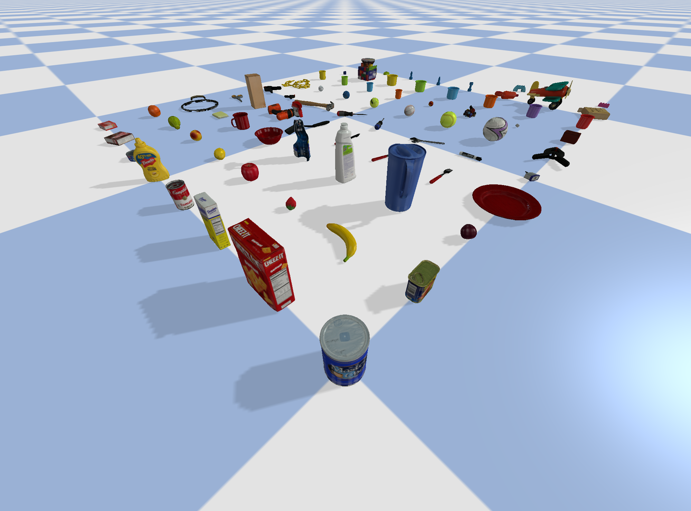

# YCB URDFs

This repository contains the YCB object models as URDF files, for use in simulation environments.



More information on the objects can be found [here](https://www.ycbbenchmarks.com/).

## Download All Objects

To download all object models, clone the repository or download it as a ZIP file:
```
git clone https://github.com/kwonathan/ycb_urdfs.git
```

## Build Objects from Scratch

You can also build all or a subset of the object models from scratch by following these steps:

1. Download [this script](https://github.com/sea-bass/ycb-tools/blob/main/download_ycb_dataset.py).

2. Choose which objects you would like to download, by changing the `objects_to_download` variable, as shown in the comments. The full list of available objects can be found [here](http://ycb-benchmarks.s3-website-us-east-1.amazonaws.com/).

3. Choose the file types to download, by changing the `files_to_download` variable. You can find more information on the different file types [here](http://ycb-benchmarks.s3-website-us-east-1.amazonaws.com/). The objects in this repository were downloaded with `files_to_download = ["google_16k"]`.

4. Run the script to download the object models:
   ```
   python download_ycb_dataset.py
   ```
   Note that it may take some time for the object models to finish downloading.

5. Now that the object models have finished downloading, we need to generate URDF files for each object. First, clone [this repository](https://github.com/harvard-microrobotics/object2urdf):
   ```
   git clone https://github.com/harvard-microrobotics/object2urdf.git
   ```

6. Move the newly downloaded object models to `object2urdf/examples/ycb`. You will find a few object models already in this directory.

7. Replace the code in `object2urdf/examples/build_object_library.py` with the following:
   ```python
   import os
   import sys
   from object2urdf import ObjectUrdfBuilder
   
   # Build entire libraries of URDFs
   object_folder = "ycb"
   builder = ObjectUrdfBuilder(object_folder)
   builder.build_library(decompose_concave=True)
   ```
   You can find more information on the code in the [object2urdf repository](https://github.com/harvard-microrobotics/object2urdf).

8. Navigate to the `object2urdf/examples` directory:
   ```
   cd object2urdf/examples
   ```
   Then, generate the URDF files:
   ```
   python build_object_library.py
   ```
   You will find the URDF files in the `object2urdf/examples/ycb` directory.

You can then move the downloaded object asset files and the generated URDF files to your working directory to load them in the simulator.

## Usage

You can find an example script to load the objects in the PyBullet simulation environment in this repository.

Run the example script with the following command:
```
python example.py
```

More information on PyBullet can be found [here](https://pybullet.org/wordpress/). The GitHub page can be found [here](https://github.com/bulletphysics/bullet3). A useful quickstart guide can be found [here](https://docs.google.com/document/d/10sXEhzFRSnvFcl3XxNGhnD4N2SedqwdAvK3dsihxVUA/edit?usp=sharing).
